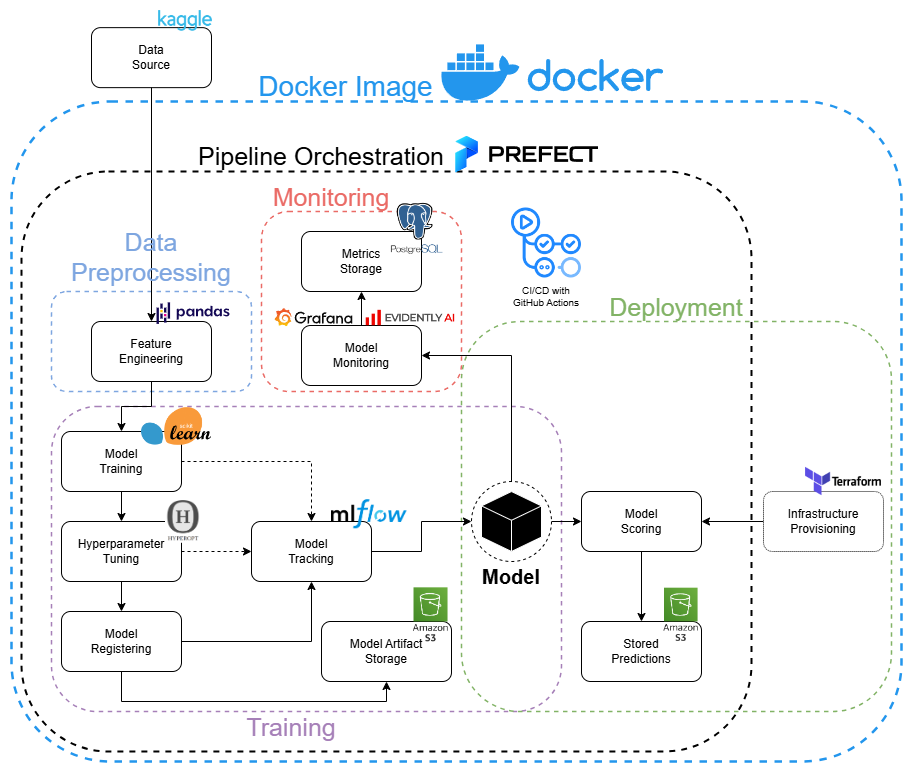
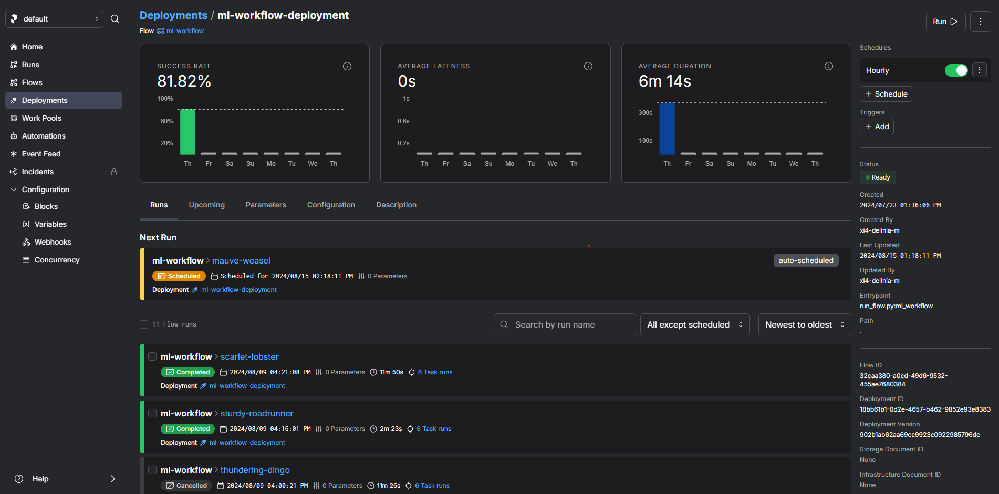
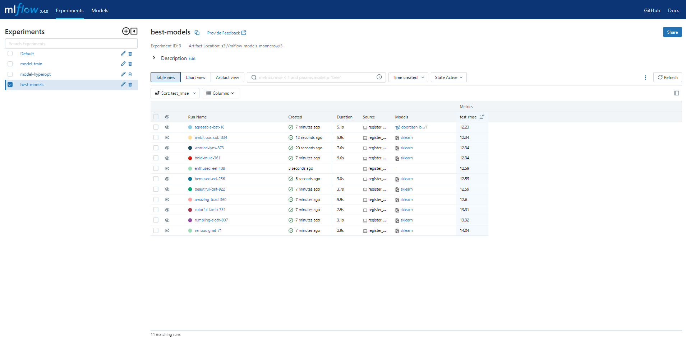
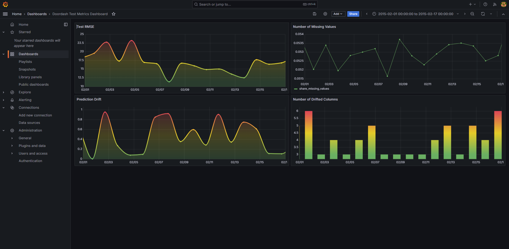

[toc]
# doordash-duration-prediction

## 📄 Problem Description

The objective of this project is to predict the delivery duration for DoorDash orders using historical data. This involves developing a machine learning model that can accurately forecast the time it will take for a delivery to reach the customer from the moment an order is placed. The project will leverage MLOps principles to ensure robust experimentation, model tracking, monitoring, infrastructure provisioning, and automation throughout the development and deployment lifecycle.

## 🗺️ MLOps Flow Diagram



- [doordash-duration-prediction](#doordash-duration-prediction)
  - [📄 Problem Description](#-problem-description)
  - [🗺️ MLOps Flow Diagram](#️-mlops-flow-diagram)
  - [📊 Dataset](#-dataset)
  - [🔒 Authentication](#-authentication)
  - [⚙️ Installation](#️-installation)
  - [🚀 Running the Project](#-running-the-project)
  - [🌐 Viewing Prefect Cloud](#-viewing-prefect-cloud)
  - [🛠️ Infrastructure Provisioning with Terraform](#️-infrastructure-provisioning-with-terraform)
  - [🧪 Experiment and Model Tracking with MLFlow](#-experiment-and-model-tracking-with-mlflow)
  - [📈 Monitoring with Evidently and Grafana](#-monitoring-with-evidently-and-grafana)
  - [🔍 How It Works](#-how-it-works)
  - [🔄 Reproducability](#-reproducability)
  - [🚀✨ MLOps Best Practices](#-mlops-best-practices)
    - [Makefile](#makefile)
      - [🛠 Installing Make and Pipenv](#-installing-make-and-pipenv)
      - [📜 Makefile Commands Overview](#-makefile-commands-overview)
    - [Pre-Commit Hooks](#pre-commit-hooks)
    - [🛠️ CI/CD Pipeline](#️-cicd-pipeline)

## 📊 Dataset

The dataset used for this project is sourced from [Kaggle](https://www.kaggle.com/datasets/dharun4772/doordash-eta-prediction) and contains various features related to DoorDash orders, such as pickup and drop-off locations, timestamps, order size, and other relevant attributes.

## 🔒 Authentication

This project requires Kaggle, AWS, and Prefect accounts. Kaggle is used to download the dataset, AWS is used to store the model and predictions in S3 and the Docker images with ECR, and Prefect is used for pipeline orchestration.

## ⚙️ Installation

To get started with the project, follow these steps:

**1. Clone the repository:**

```bash
git clone https://github.com/Danselem/doordash-duration-prediction
cd doordash-duration-prediction
```

**2. Set up Authentication:**

- Place your kaggle.json in the root directory of this project.
- Copy `.env.template` to `.env` using the following command:

```bash
cp .env.template .env
```

### Instructions for installing other dependencies
**Terraform**: Follow the instruction in the [link](https://developer.hashicorp.com/terraform/tutorials/aws-get-started/install-cli).
**Astral `uv`**: [link](https://docs.astral.sh/uv/getting-started/installation/).

```bash
sudo snap install astral-uv --classic && \
sudo snap install aws-cli --classic
```

- **Important:** Open the .env file and fill in all required details before proceeding.

**3. Manually create an S3 bucket for the Terraform state:**

Create an S3 bucket and update the `'/infrastructure.main.tf'` file to reflect the new bucket.

## 🚀 Running the Project

To run the project, simply run the following command:

```bash
docker compose up
```

This command will start a multi-container Docker project, setting up and starting all necessary services, including `mlflow`, `postgres`, `adminer`, `grafana`, and the main application.

## 🌐 Viewing Prefect Cloud

The app service provides a link [https://app.prefect.cloud/auth/resume](https://app.prefect.cloud/auth/resume) to Prefect Cloud. Open this link to access the Prefect Cloud UI, which offers detailed insights into deployments and previous runs. While the deployment is scheduled to run every 30 minutes, you can manually initiate a run by clicking 'Run' for immediate execution.



## 🛠️ Infrastructure Provisioning with Terraform

This project leverages Terraform to automate the setup of AWS S3 buckets for storing model artifacts and predictions, as well as an Amazon ECR repository for the Docker image. Utilizing Terraform ensures that the infrastructure is provisioned consistently and reproducibly, reducing the risk of manual errors. This automation is crucial for maintaining a reliable workflow, especially in a production environment. It is important to note that the user should manually create an S3 bucket for storing the Terraform state, which helps in tracking infrastructure changes over time and enables collaborative infrastructure management.

## 🧪 Experiment and Model Tracking with MLFlow

This project utilizes MLFlow for experiment and model tracking, allowing users to log metrics, parameters, and artifacts for their machine learning experiments. By providing a centralized place to track model performance, MLFlow ensures reproducibility and simplifies the comparison of different model runs. This tool is essential for maintaining an organized workflow and improving model management over time. To view and manage experiments, navigate to [http://localhost:5000/](http://localhost:5000/).



## 📈 Monitoring with Evidently and Grafana

For effective monitoring of the model's performance and data quality, this project utilizes Evidently and Grafana. Users can access the monitoring dashboard by navigating to [http://localhost:3000/login](http://localhost:3000/login) and logging in with the username 'admin' and password 'admin'. Once logged in, navigate to the dashboards section to view a comprehensive dashboard that displays key metrics such as test RMSE, prediction drift, the number of drifted columns, and the number of missing values. This setup ensures continuous insight into the model's performance and data integrity, facilitating prompt detection and resolution of any issues.



## 🔍 How It Works

This section provides an overview of the primary scripts and their functionalities within the project, illustrating the workflow from data preprocessing to model deployment and monitoring:

**`experimentation.ipynb`**

This Jupyter notebook is used for exploratory data analysis (EDA) and initial experimentation with the DoorDash delivery duration prediction dataset. It imports necessary packages and downloads the dataset from Kaggle. The notebook includes steps for data exploration, such as loading the dataset into a Pandas DataFrame, checking for missing values, and creating new features like delivery duration. It also performs data visualization to identify outliers and understand data distributions. The notebook demonstrates the process of data cleaning by removing outliers and preparing features for modeling. It concludes with building a simple linear regression model using a pipeline, splitting the data into training and test sets, and evaluating model performance using metrics like RMSE and MAE. This notebook serves as an interactive environment to explore and experiment with different approaches before formalizing them into the main project pipeline.

**`start.sh`**

This Bash script automates the setup and deployment process for the project. It begins by loading environment variables from a `.env file` and exporting them. The script then navigates to the Terraform directory to initialize and apply the Terraform configurations, setting up the necessary infrastructure. After returning to the main directory, it logs in to AWS ECR. The script tags the Docker image and pushes it to the ECR repository.

**`run_flow.py`**

This script initiates and executes the Prefect flow, orchestrating the entire machine learning pipeline from data preprocessing to model registration. It ensures each step is executed sequentially and correctly, running the pipeline on a 30 minute schedule.

**`data_preprocess.py`**

This script prepares raw data for machine learning using `pandas`, `scikit-learn`, and the `Kaggle API`. It reads the raw data, creates a delivery duration feature, handles missing values, and removes outliers. The script then extracts relevant features, vectorizes them, and splits the data into training, validation, and test sets. This ensures the data is clean and well-structured for model training and evaluation.

**`train.py`**

This script trains and evaluates baseline models without hyperparameter tuning. It leverages `MLflow` to log model performance and metrics for models such as `LinearRegression`, `XGBRegressor`, and `Ridge`. The script reads processed data, trains each model, evaluates it using RMSE, and logs the results to `MLflow`. This ensures reproducibility and easy tracking of model performance.

**`hpo.py`**

This script performs hyperparameter optimization (HPO) for selected models using `Hyperopt` and logs the hyperparameters and performance metrics for each trial using `MLflow`. Hyperparameter tuning involves systematically searching for the best set of parameters that improves the model's performance. The script optimizes models such as `Ridge` and `XGBRegressor`, enhancing their performance by exploring various hyperparameter configurations. It reads processed data, runs the optimization, and records the results to ensure efficient model tuning.

**`register_model.py`**

This script identifies and registers the best-performing models using `MLflow`. It evaluates models from hyperparameter optimization and training experiments based on validation and test RMSE. The script reads processed data, trains and evaluates models, and registers the best model to ensure reproducibility and ease of deployment. The best model is stored in the default artifact location specified in the .env file.

**`score_batch.py`**

This script applies the best-performing machine learning model to the test dataset and saves the prediction results to an S3 bucket. It reads the processed test data, loads the best model from the specified S3 bucket using `MLflow`, and generates predictions. Hyperparameter tuning systematically searches for the best set of parameters to improve model performance. The script handles the creation of the destination S3 bucket if it does not already exist. The results, including predicted and actual durations along with the model version, are saved as a Parquet file in the specified S3 bucket. The environment variables, such as MLFLOW_TRACKING_URI and AWS_DEFAULT_REGION, are loaded from the .env file.

**`monitor_metrics.py`**

This script utilizes multiple libraries such as `pandas`, `psycopg`, `mlflow`, and `evidently` to monitor and store metrics in PostgreSQL. It begins by initializing MLflow for model tracking and loading the best model from an S3 bucket. The script then sets up the monitoring process by loading and predicting on test data, decoding dataframes, and defining column mappings for numerical and categorical features. It uses the Evidently library to generate a report that includes metrics like column drift, dataset drift, missing values, and regression quality. These metrics are then calculated and stored in a PostgreSQL database on a daily basis, filtered by the 'created_at' timestamp, with each day's data processed individually. The reports can be viewed and visualizations can be created by logging into the Grafana interface.

**`utils.py`**

This script contains utility functions that are utilized across different project scripts, promoting modularity and reusability within the codebase. Specifically, it includes helper functions for loading and dumping pickle files, and a function to decode a one-hot encoded DataFrame back to its original format using the DictVectorizer.

## 🔄 Reproducability

To ensure reproducibility, this project’s environment is managed with `pipenv`. While `pipenv` is the primary tool for handling dependencies, a `requirements.txt` file is also included for reference purposes. This helps users understand the specific packages and versions used in the project.

## 🚀✨ MLOps Best Practices

### Makefile

A `Makefile` simplifies software development by defining targets that automate command sequences, reducing the need to manually input complex commands. Each target can perform tasks, run scripts, or manage dependencies efficiently. Here's an overview of the commands provided:

**Important:** To use the Makefile, users will need to have both pipenv and Make installed on their system.

#### 🛠 Installing Make and Pipenv

**Windows:**

**1. Download and Install Make:**

- Download the latest version of Make for Windows.
- Install the downloaded package.

**2. Install Pipenv:**

- Open your terminal (Command Prompt, Git Bash, or PowerShell).
- Install Pipenv using `pip`:

```bash
pip install pipenv
```

**Linux:**

**1. Install Make:**

- Use your package manager (e.g., `apt`, `yum`, `dnf`):

```bash
sudo apt-get install make
```

**2. Install Pipenv:**

- Open your terminal (Command Prompt, Git Bash, or PowerShell).
- Install Pipenv using `pip`:

```bash
pip install pipenv
```

#### 📜 Makefile Commands Overview

- **`setup`**: Installs development dependencies and sets up pre-commit hooks.
- **`test`**: Runs unit tests using `pytest`.
- **`integration_test`**: Placeholder for testing interactions between different components of your application.
- **`quality_checks`**: Performs code formatting with `isort` and `black`.
- **`terraform-init`**: Initializes Terraform configurations.
- **`terraform-apply`**: Applies Terraform configurations.
- **`build`**: Builds a Docker image after passing tests and quality checks.
- **`push`**: Pushes the Docker image to AWS ECR.
- **`run`**: Starts Docker containers after tests.
- **`all`**: Builds and pushes the Docker image by running the `push` command.

### Pre-Commit Hooks

A pre-commit hook is a script that runs automatically before each commit to check for code errors and style violations, ensuring that only high-quality code is committed to the repository. Use the following steps to set up and use pre-commit hooks:

**1. Clone the Repository**

```bash
git clone https://github.com/Danselem/doordash-duration-prediction
cd doordash-duration-prediction
```

**2. Setup the Development Environment**

Instead of manually installing dependencies and pre-commit hooks, you can simply run the make setup command which automates these steps:

```bash
make setup
```

This command initializes the development environment by installing all necessary dependencies and setting up pre-commit hooks as specified in the .pre-commit-config.yaml file.

**3. Make and Commit Changes**

```bash
git add <files>
git commit -m "Your commit message"
```

### 🛠️ CI/CD Pipeline

**Continuous Integration (CI)**

Continuous Integration is a practice in software development where code changes are automatically tested and validated as soon as they are committed to the repository. This helps ensure that the newly integrated code works as expected and doesn't break existing functionality.

For this project, CI was incorporated by setting up a GitHub Actions workflow that runs every time a pull request is made to the `main` branch. The workflow performs the following steps:

- **Dependency Installation:** Installs required Python dependencies.
- **Unit and Integration Testing:** Runs unit tests to validate that the code behaves as expected.
- **Code Quality Checks:** Ensures that the code adheres to best practices by running tools like black and isort for formatting.
- **Terraform Plan:** Executes Terraform to ensure that infrastructure changes are valid before applying them.

This process helps maintain code quality and detect issues early in the development process.

**Continuous Deployment (CD)**

Continuous Deployment is the automated process of deploying your application to production after it passes the testing phase. In this project, CD was implemented to automate the deployment of the Dockerized application to AWS, specifically utilizing Amazon Elastic Container Registry (ECR) and Docker Compose.

Whenever code is pushed to the main branch or manually triggered, the CD workflow performs the following tasks:

- **Build the Docker Image:** Builds the Docker image using the application's Dockerfile.
- **Push to ECR:** Tags the image and pushes it to the Amazon ECR repository.
- **Run Docker Compose:** Brings up the required services by running docker compose up.

This ensures that any updates to the code are quickly and reliably deployed to production without manual intervention.


### Issues
If you get the error below while running `make terraform-init`.

```bash
 Error: validating provider credentials: retrieving caller identity from STS: operation error STS: GetCallerIdentity, https response error StatusCode: 403,
```


**Solution**
Remove the backend component in the `main.tf` file inside the `infrstructure` directory.

```bash
backend "s3" {
    bucket  = "doordash-pred"
    key     = "doordash-pred-stg.tfstate"
    region  = "us-east-1"
    encrypt = true
  }
```

### Notes
Copy kaggle

```bash
cp kaggle.json ~/.config/kaggle/

chmod 600 ~/.config/kaggle/kaggle.json
```

```bash
uv run python src/run_flow.py
uv run python src/data_preprocess.py
uv run python src/train.py
uv run python src/hpo.py 
export MLFLOW_TRACKING_URI="http://localhost:5000"
uv run python src/register_model.py
uv run python src/upload_s3.py  
uv run python src/test_s3.py
uv run python src/monitor_metrics.py


uv run python src/score_batch.py 
```

If `PermissionError: [Errno 13] Permission denied: '/app'`
sudo mkdir -p /app
sudo chown $USER:$USER /app
sudo chmod 775 /app


uv run python src/score_batch.py